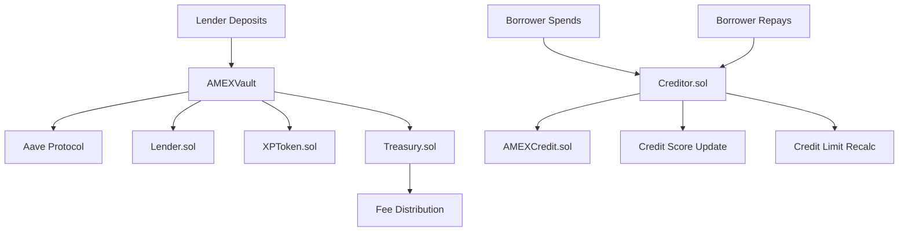

# AMEX Protocol: Yield, XP, and Credit Score Calculation Report

## Executive Summary

This report provides a comprehensive analysis of the three core calculation mechanisms in the AMEX Protocol:
- **Yield Generation & Distribution** (AMEXVault.sol)
- **Experience Points (XP) System** (XPToken.sol) 
- **Dynamic Credit Scoring** (Creditor.sol)

These systems work together to create a sustainable DeFi lending ecosystem with gamified incentives and risk-based credit allocation.

---

## 1. YIELD CALCULATION (AMEXVault.sol)

### 1.1 Yield Generation Mechanism

The AMEX Protocol generates yield through **Aave integration**:

```solidity
// User deposits USDC → Vault deposits to Aave
aavePool.deposit(address(usdc), assets, address(this), 0);
// Vault receives interest-bearing aUSDC tokens that appreciate over time
```

### 1.2 Fee Structure

| Fee Type | Rate | Purpose |
|----------|------|---------|
| **Yield Fee** | 1% | Protocol treasury from yield generation |
| **Merchant Withdrawal Fee** | 2.5% | Additional fee for merchant withdrawals |

```solidity
uint256 public constant YIELD_FEE_PERCENTAGE = 1; // 1% of yield goes to Treasury
uint256 public constant MERCHANT_WITHDRAWAL_FEE = 250; // 2.5% for merchant withdrawals
```

### 1.3 Yield Calculation Process

#### Step 1: Deposit Phase
1. User deposits USDC to vault
2. Vault deposits USDC to Aave
3. Vault receives aUSDC (interest-bearing tokens)
4. User receives vault shares representing their deposit

#### Step 2: Yield Accumulation
- aUSDC balance grows automatically via Aave interest
- Yield = `current_aUSDC_balance - original_deposit`

#### Step 3: Withdrawal & Fee Collection
```solidity
// Calculate yield portion of withdrawal
if (assets > proportionalDeposit) {
    uint256 yield = assets - proportionalDeposit;
    treasuryShare = (yield * YIELD_FEE_PERCENTAGE) / 100;
    totalWithdrawFromAave = assets + treasuryShare;
}
```

### 1.4 Yield Distribution Example

**Scenario**: User deposits $1,000, earns $50 yield over time

```
Original Deposit: $1,000
Yield Generated: $50
Total Withdrawal Request: $1,050

Treasury Fee: $50 × 1% = $0.50
User Receives: $1,050 - $0.50 = $1,049.50
Treasury Receives: $0.50
```

---

## 2. XP POINTS CALCULATION (XPToken.sol)

### 2.1 XP System Overview

The XP system rewards lenders with **non-transferable experience points** based on:
- **Deposit amount** (principal factor)
- **Time duration** (linear accumulation)
- **Deposit tiers** (bonus multipliers)

### 2.2 XP Rate Parameters

```solidity
// Base earning rate
uint256 public constant BASE_XP_RATE = 1e15; // 0.001 XP per second per dollar

// Bonus thresholds with multipliers
uint256 public constant BONUS_THRESHOLD_1 = 1000e18;  // $1,000 → 1.5x
uint256 public constant BONUS_THRESHOLD_2 = 5000e18;  // $5,000 → 2x  
uint256 public constant BONUS_THRESHOLD_3 = 10000e18; // $10,000 → 3x
```

### 2.3 XP Rate Calculation Algorithm

```solidity
function _calculateXPRate(uint256 depositAmount) internal pure returns (uint256) {
    if (depositAmount == 0) return 0;
    
    uint256 rate = BASE_XP_RATE; // Start with base rate
    
    // Apply tier-based multipliers
    if (depositAmount >= BONUS_THRESHOLD_3) {        // $10,000+
        rate = rate * 3;                             // 3x multiplier
    } else if (depositAmount >= BONUS_THRESHOLD_2) { // $5,000-$9,999
        rate = rate * 2;                             // 2x multiplier
    } else if (depositAmount >= BONUS_THRESHOLD_1) { // $1,000-$4,999
        rate = (rate * 3) / 2;                       // 1.5x multiplier
    }
    // Under $1,000 gets base rate (1x)
    
    return rate;
}
```

### 2.4 XP Earning Formula

```solidity
function _calculateEarnedXP(address lender) internal view returns (uint256) {
    LenderXP memory xpData = lenderXP[lender];
    
    uint256 timeElapsed = block.timestamp - xpData.lastUpdateTime;
    return (timeElapsed * xpData.xpRate * xpData.depositAmount) / 1e18;
}
```

**Formula**: `XP Earned = Time(seconds) × XP_Rate × Deposit_Amount / 1e18`

### 2.5 XP Earning Examples

| Deposit Amount | Tier | Multiplier | XP Rate (per sec/$) | XP per Day | XP per Month |
|---------------|------|------------|-------------------|------------|--------------|
| $100 | Base | 1x | 0.001 | 8.64 | 259.2 |
| $1,000 | Tier 1 | 1.5x | 0.0015 | 129.6 | 3,888 |
| $5,000 | Tier 2 | 2x | 0.002 | 864 | 25,920 |
| $10,000 | Tier 3 | 3x | 0.003 | 2,592 | 77,760 |

### 2.6 XP Token Properties

**Non-transferable**: Cannot be traded or sent between accounts  
**Real-time earning**: Updated automatically on deposits/withdrawals  
**Manual claiming**: Users can call `claimPendingXP()` anytime  
**Admin controls**: Admins can award/burn XP for special events  
**Audit trail**: Complete earning history tracked on-chain  

### 2.7 XP Integration Points

- **Vault Integration**: AMEXVault calls `updateLenderDeposit()` on every transaction
- **Lender Tracking**: Coordinates with Lender.sol for cross-vault totals
- **Treasury Rewards**: XP could be used for fee rebates or governance rights

---

## 3. CREDIT SCORE CALCULATION (Creditor.sol)

### 3.1 Credit Scoring Overview

The AMEX credit system implements a **dynamic scoring model** that adjusts based on borrower behavior:
- **Initial Score**: 500 (middle of 100-1000 range)
- **Score Range**: 100 (minimum) to 1000 (maximum)
- **Adjustment Triggers**: Repayments (+) and late payments (-)

### 3.2 Adjustable Credit Parameters

```solidity
// Base configuration (adjustable by admin)
uint256 public baseCreditLimit = 100 * 1e18;     // $100 starting limit
uint256 public initialCreditScore = 500;          // Starting score
uint256 public maxCreditScore = 1000;             // Maximum score
uint256 public minCreditScore = 100;              // Minimum score
uint256 public scoreIncreasePerRepayment = 10;    // +10 per repayment
uint256 public scoreDecreasePerLatePayment = 25;  // -25 per late payment
uint256 public creditLimitMultiplier = 2;         // Credit limit factor
```

### 3.3 Credit Score Improvement Logic

#### On-Time Repayment Bonus
```solidity
function _calculateNewScoreOnRepayment(address borrower) internal view returns (uint256) {
    BorrowerProfile memory profile = s_borrowerProfiles[borrower];
    uint256 score = profile.creditScore;
    
    // Add points for successful repayment
    score = score > maxCreditScore - scoreIncreasePerRepayment
        ? maxCreditScore  // Cap at maximum
        : score + scoreIncreasePerRepayment;
        
    return score;
}
```

#### Late Payment Penalty
```solidity
// Decrease score for late payments (called by oracle/admin)
score = score < minCreditScore + scoreDecreasePerLatePayment
    ? minCreditScore  // Floor at minimum
    : score - scoreDecreasePerLatePayment;
```

### 3.4 Credit Limit Calculation

The credit limit is dynamically calculated based on the borrower's score:

```solidity
function _calculateNewCreditLimit(address borrower) internal view returns (uint256) {
    BorrowerProfile memory profile = s_borrowerProfiles[borrower];
    
    if (profile.creditScore <= initialCreditScore) {
        return baseCreditLimit; // Base $100 limit
    }
    
    // Calculate bonus for scores above initial
    uint256 scoreAboveBase = profile.creditScore - initialCreditScore;
    uint256 multiplier = (scoreAboveBase * creditLimitMultiplier) / 100;
    
    return baseCreditLimit + ((baseCreditLimit * multiplier) / 100);
}
```

### 3.5 Credit Score Evolution Examples

| Scenario | Starting Score | Actions | Final Score | Credit Limit | Change |
|----------|---------------|---------|-------------|--------------|--------|
| **New Borrower** | 500 | Registration | 500 | $100.00 | Baseline |
| **Good Behavior** | 500 | 5 repayments | 550 | $110.00 | +$10 |
| **Excellent History** | 500 | 10 repayments | 600 | $120.00 | +$20 |
| **Stellar Record** | 500 | 25 repayments | 750 | $150.00 | +$50 |
| **Maximum Rating** | 500 | 50 repayments | 1000 | $200.00 | +$100 |
| **Mixed Record** | 600 | 2 late payments | 550 | $110.00 | -$10 |

### 3.6 Detailed Credit Limit Calculation

**Example**: Borrower with credit score of 720

```
Step 1: Check if score > initial
720 > 500 ✓ (Qualifies for bonus)

Step 2: Calculate score improvement
scoreAboveBase = 720 - 500 = 220

Step 3: Apply multiplier
multiplier = (220 × 2) / 100 = 4.4

Step 4: Calculate bonus limit
bonusLimit = (100 × 4.4) / 100 = $4.40

Step 5: Final credit limit
creditLimit = $100 + $4.40 = $104.40
```

### 3.7 Credit Risk Management

- **Borrower Profiles**: Track spending, repayment history, and risk metrics
- **Dynamic Limits**: Credit limits adjust automatically with score changes
- **Pause Functionality**: Admins can pause risky borrowers
- **Debt Tracking**: Outstanding debt monitored against credit limits

---

## 4. SYSTEM INTEGRATION & DATA FLOW

### 4.1 Cross-Contract Communication



### 4.2 Complete User Journey

#### Lender Journey
1. **Deposit**: User deposits USDC → Vault → Aave
2. **Tracking**: Lender.sol records deposit, XPToken starts earning
3. **Yield**: aUSDC appreciates, generating yield
4. **XP Accumulation**: Continuous earning based on deposit × time × tier
5. **Withdrawal**: User withdraws principal + yield - 1% treasury fee

#### Borrower Journey
1. **Registration**: Admin registers borrower (500 credit score, $100 limit)
2. **Spending**: Borrower spends against credit limit via merchants
3. **Debt Tracking**: Outstanding debt tracked in real-time
4. **Repayment**: On-chain or off-chain repayment confirmed
5. **Score Update**: +10 points per repayment, credit limit recalculated

### 4.3 Mathematical Relationships

| System | Growth Type | Formula |
|--------|-------------|---------|
| **Yield** | Linear | `Aave_Rate × Time × Principal` |
| **XP Points** | Linear with Tiers | `Time × Rate × Deposit × Multiplier` |
| **Credit Score** | Activity-Based | `Score ± Adjustment_per_Action` |
| **Credit Limit** | Score-Exponential | `Base + (Base × Score_Bonus × Multiplier / 100)` |

---

## 5. ECONOMIC INCENTIVES & TOKENOMICS

### 5.1 Revenue Streams for Protocol

1. **Yield Fees**: 1% of all Aave yield generated
2. **Merchant Fees**: 2.5% on merchant withdrawals  
3. **Potential Future**: XP redemption fees, premium features

### 5.2 User Incentive Alignment

#### For Lenders
- **Primary**: Aave yield (99% after fees)
- **Secondary**: XP points with tier bonuses
- **Future**: XP utility (governance, fee rebates, exclusive features)

#### For Borrowers  
- **Credit Building**: Higher scores → Higher limits
- **Low Cost**: No upfront fees, pay-as-you-use model
- **Flexibility**: On-chain and off-chain repayment options

### 5.3 Risk Mitigation

- **Collateralized**: All credit backed by lender deposits in Aave
- **Dynamic Limits**: Credit limits adjust with behavior
- **Treasury Reserves**: Protocol fees create safety buffer
- **Emergency Controls**: Admin pause/unpause functionality

---

## 6. TECHNICAL IMPLEMENTATION DETAILS

### 6.1 Contract Architecture

```
AMEXVault.sol (ERC4626)
├── Aave Integration (yield generation)
├── Fee Collection (1% yield, 2.5% merchant)
├── Lender.sol Integration (deposit tracking)
└── XPToken.sol Integration (XP updates)

Creditor.sol
├── Credit Scoring Engine
├── Dynamic Limit Calculation  
├── AMEXCredit.sol Integration (mint/burn)
└── Oracle Integration (off-chain repayments)

XPToken.sol (ERC20, Non-transferable)
├── Time-based Earning Algorithm
├── Tier-based Multipliers
├── Vault Integration Hooks
└── Admin Management Functions
```

### 6.2 Key Functions & Gas Optimization

#### High-Frequency Functions (Optimized)
- `deposit()` / `withdraw()`: Single transaction updates all systems
- `spend()`: Efficient credit limit checking
- `claimPendingXP()`: Batched XP calculation

#### Administrative Functions
- `updateCreditParameters()`: Adjustable scoring system
- `authorizeVault()`: XP system vault management
- `collectYieldFee()`: Treasury fee collection

### 6.3 Security Considerations

**ReentrancyGuard**: All external calls protected  
**Role-Based Access**: Granular permission system  
**Parameter Validation**: Input sanitization and bounds checking  
**Emergency Controls**: Pause functionality for critical issues  
**Audit Trail**: Comprehensive event logging  

---

## 7. FUTURE ENHANCEMENTS & ROADMAP

### 7.1 XP System Enhancements
- **XP Utility**: Governance voting, fee discounts, exclusive features
- **XP Marketplace**: Non-transferable but redeemable for protocol benefits
- **Gamification**: Achievements, leaderboards, seasonal bonuses

### 7.2 Credit Scoring Improvements
- **ML Integration**: Off-chain models feeding on-chain decisions
- **Multi-factor Scoring**: Include transaction patterns, social signals
- **Cross-Protocol**: Import credit history from other DeFi protocols

### 7.3 Yield Optimization
- **Multi-Protocol**: Beyond Aave (Compound, Yearn, etc.)
- **Auto-Compounding**: Reinvest fees automatically
- **Yield Strategies**: Active yield farming optimization

---

## 8. PERFORMANCE METRICS & KPIs

### 8.1 Lender Metrics
- **Average Yield**: Net yield after fees (target: 3-5% APY)
- **XP Distribution**: Track earning rates across tiers
- **Retention Rate**: Long-term lender engagement

### 8.2 Borrower Metrics  
- **Credit Utilization**: Average % of limit used
- **Repayment Rate**: On-time repayment percentage
- **Score Distribution**: Credit score improvements over time

### 8.3 Protocol Health
- **Treasury Growth**: Fee accumulation rate
- **Collateralization Ratio**: Deposits vs. outstanding credit
- **User Growth**: New lenders and borrowers per month

---

## Conclusion

The AMEX Protocol creates a **sophisticated three-pillar system** that aligns incentives across all participants:

1. **Yield Generation**: Sustainable returns through battle-tested Aave integration
2. **XP Rewards**: Gamified loyalty system encouraging long-term participation  
3. **Dynamic Credit**: Risk-based credit allocation that scales with borrower behavior

This design creates **positive feedback loops** where:
- Responsible borrowers earn higher credit limits
- Long-term lenders earn bonus XP rewards
- The protocol generates sustainable fee revenue
- Risk is managed through dynamic credit scoring

The system is built for **scalability, security, and sustainability** - ready to onboard the next generation of DeFi users!

---

*Generated on: August 19, 2025*  
*Contract Version: Alpha-v1*  
*Report Version: 1.0*
